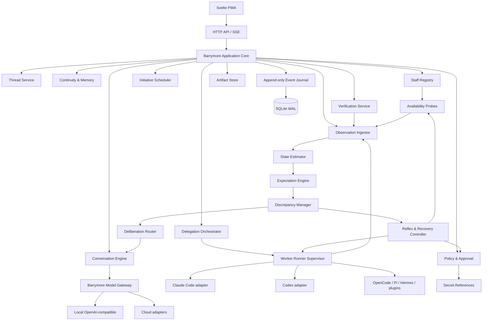

# Бэрримор — сводная спецификация


---

<!-- SOURCE: README.md -->

# Бэрримор

**Бэрримор** — локальная персональная система непрерывности, общения и делегирования работы внешним агентам.

Это не очередной coding agent, не чат с памятью и не универсальный агентный харнесс. Пользователь постоянно взаимодействует с Бэрримором, а Бэрримор хранит общую историю, ведёт долгоживущие нити, знает доступных исполнителей, готовит им поручения, запускает их в контролируемой среде, принимает результат и обновляет канонический контекст.

Рабочая формула проекта:

> **Один постоянный дворецкий, много сменяемых работников.**

В инженерном смысле Бэрримор строится как постоянная распределённая система, а не как непрерывно запущенная LLM. Runtime хранит состояние, наблюдает среду, поддерживает ожидания, замечает расхождения, выполняет безопасные локальные реакции и вызывает языковую модель только там, где требуется интерпретация, планирование или разговор.

LLM, которая формулирует ответы Бэрримора, может меняться. Claude Code, Codex CLI, OpenCode, Pi, Hermes, локальные модели и будущие агенты могут подключаться и исчезать. Личность Бэрримора, память, решения, границы, история отношений, ожидания и состояние поручений принадлежат runtime и данным, а не конкретной модели. Метафора «организма» описывает архитектуру управления и не является заявлением о сознании.

## Документы

| Документ | Назначение |
|---|---|
| [00_PRODUCT_VISION.md](docs/00_PRODUCT_VISION.md) | Замысел, ценность и основные принципы |
| [01_PRODUCT_BOUNDARY.md](docs/01_PRODUCT_BOUNDARY.md) | Чем Бэрримор является и чем не является |
| [02_DOMAIN_MODEL.md](docs/02_DOMAIN_MODEL.md) | Нити, память, позиции, обязательства, исполнители и поручения |
| [03_SYSTEM_ARCHITECTURE.md](docs/03_SYSTEM_ARCHITECTURE.md) | Предиктивный runtime, компоненты, процессы, хранение и интерфейсы |
| [04_MEMORY_AND_CONTINUITY.md](docs/04_MEMORY_AND_CONTINUITY.md) | Память о пользователе, общая история и собственная позиция Бэрримора |
| [05_STAFF_AND_DELEGATION.md](docs/05_STAFF_AND_DELEGATION.md) | Реестр агентов, доступность, выбор и контролируемый запуск |
| [06_SECURITY_AND_TRUST.md](docs/06_SECURITY_AND_TRUST.md) | Политики, разрешения, секреты, изоляция и аудит |
| [07_USER_EXPERIENCE.md](docs/07_USER_EXPERIENCE.md) | Основные экраны и пользовательские сценарии |
| [08_API_AND_EVENTS.md](docs/08_API_AND_EVENTS.md) | API, события и контракты адаптеров |
| [09_DEVELOPMENT_PLAN.md](docs/09_DEVELOPMENT_PLAN.md) | Этапы разработки и первый проверяемый вертикальный срез |
| [10_ACCEPTANCE_SCENARIOS.md](docs/10_ACCEPTANCE_SCENARIOS.md) | Приёмочные сценарии и критерии качества |
| [11_ENGINEERING_AUTHORITY.md](docs/11_ENGINEERING_AUTHORITY.md) | Полномочия и ограничения Codex/Claude Code |
| [12_BOOTSTRAP_PROMPT.md](docs/12_BOOTSTRAP_PROMPT.md) | Стартовый промпт для первого большого прохода |
| [AGENTS.md](AGENTS.md) | Инструкция для Codex и других coding agents |
| [CLAUDE.md](CLAUDE.md) | Инструкция для Claude Code |
| [IMPLEMENTATION_STATUS.md](IMPLEMENTATION_STATUS.md) | Честный статус реализации |

## Первоначальные технические defaults

Начальная архитектура: Linux-first, Go modular monolith, Svelte 5 + TypeScript, SQLite WAL, versioned HTTP API, SSE и отдельный контролируемый process runner. Эти решения являются сильными defaults, но не догмой. Замена допустима через ADR, если сохраняются пользовательские инварианты и проверяемость.

## Главный первый результат

Первый большой проход не должен пытаться реализовать «всю цифровую личность». Он обязан доказать один законченный контур:

1. пользователь создаёт нить и разговаривает с Бэрримором;
2. важный факт или решение попадает в память только как видимый кандидат;
3. Бэрримор обнаруживает хотя бы одного установленного внешнего агента;
4. показывает его возможности, доступность, стоимость и уверенность этих данных;
5. формирует поручение на аудит реального Git-репозитория;
6. после подтверждения создаёт изолированное рабочее окружение и запускает агента;
7. поддерживает явные ожидания о ходе запуска и распознаёт отклонения;
8. при безопасном типовом сбое выполняет ограниченную локальную диагностику или восстановление без вызова LLM;
9. сохраняет весь ход работы, сырой результат, артефакты, реакции и проверки;
10. связывает подтверждённый результат с исходной нитью;
11. после перезапуска состояние, ожидания и незавершённые контуры полностью восстанавливаются.

Пока этот контур не работает, новые крупные подсистемы не добавляются.


---

<!-- SOURCE: docs/00_PRODUCT_VISION.md -->

# Видение продукта

## 1. Проблема

Современные LLM-инструменты существуют отдельными островами. Пользователь общается с ChatGPT, запускает Claude Code, Codex, OpenCode, Pi, Hermes или локальную модель, вручную переносит между ними контекст, следит за лимитами, объясняет историю проекта заново, проверяет результаты и решает, кому доверить следующую работу.

Каждый исполнитель видит только отдельную сессию. Даже сильная модель плохо знает:

- почему проект появился;
- какие решения уже принимались;
- какие попытки провалились;
- что пользователь считает принципиальным;
- где находится незавершённый worktree;
- какой агент раньше хорошо справлялся с подобными задачами;
- какие лимиты, стоимость и риски существуют прямо сейчас;
- что результат означает для долгой истории проекта или жизни пользователя.

Пользователь становится ручным диспетчером множества ИИ.

## 2. Идея

Бэрримор становится постоянной точкой взаимодействия между человеком, его историей, проектами, инструментами и сменяемыми агентами.

Он не обязан лучше Claude писать код. Он обязан лучше любого отдельного агента понимать:

- человека;
- общую историю;
- смысл текущей нити;
- состояние доступных исполнителей;
- границы допустимого;
- критерии хорошего результата;
- связь нового результата со всем, что было раньше.

Бэрримор разговаривает, спорит, помогает думать, хранит непрерывность и организует работу. Конкретные специализированные действия он может выполнять встроенными инструментами или поручать внешним агентам.

## 3. Бэрримор как предиктивная система

Бэрримор не сводится к модели, которая ждёт очередной реплики. Он постоянно поддерживает проверяемое представление о текущем состоянии системы и о том, что должно произойти дальше.

Рабочий цикл:

```text
наблюдение
→ оценка текущего состояния
→ сравнение с ожиданием
→ фиксация расхождения
→ безопасная локальная реакция или эскалация
→ обновление состояния и опыта
```

Примеры ожиданий:

- запущенный worker должен присылать heartbeat или наблюдаемые действия;
- audit-only поручение не должно менять workspace;
- после запуска тестов должен появиться exit status и артефакт;
- подтверждение действует только в заданном scope и интервале;
- состояние лимита, диска, модели и очередей имеет срок свежести;
- ожидающее внешнее событие не должно превращаться в бесконечное молчаливое ожидание.

Типовые отклонения не требуют рассуждения LLM. Runtime может проверить процесс, перечитать журнал, обновить snapshot, повторить идемпотентный probe, поставить run на паузу или восстановить соединение. Модель вызывается, когда расхождение неоднозначно, затрагивает цели, требует нового плана или объяснения пользователю.

Когнитивная граница системы проходит не вокруг LLM, а вокруг связки **runtime — данные — инструменты — workers — рабочая среда**. Git, файлы, журнал событий и внешние проверки являются частью вычислительного контура, а не пассивным хранилищем для промпта.

Это инженерная модель управления, вдохновлённая predictive processing и embodied cognition. Она не утверждает, что программа обладает сознанием или человеческим телом.

## 4. Основная сущность: нить

Главной сущностью системы является не чат и не задача, а **нить**.

Нить — долгоживущая смысловая линия:

- проект;
- идея;
- проблема;
- решение;
- исследование;
- важный разговор;
- ожидание внешнего события;
- личная тема;
- незаконченная работа.

Нить содержит не только сообщения, но и:

- происхождение и смысл;
- текущую позицию пользователя;
- текущую позицию Бэрримора;
- решения и их причины;
- открытые вопросы;
- обязательства;
- связанные файлы, репозитории, людей и события;
- прошлые попытки;
- поручения внешним исполнителям;
- подтверждённые результаты;
- статус и условия следующего движения.

Нить может быть активной, созревающей, ожидающей, заблокированной, приостановленной, завершённой или осознанно отпущенной.

## 5. Модель «мы»

Обычная персонализация строит модель пользователя. Бэрримор дополнительно строит версионируемую модель общей истории:

- что обсуждалось;
- как менялись позиции;
- где Бэрримор ошибся;
- где пользователь его поправил;
- о чём стороны договорились;
- какие обещания ещё действуют;
- какие темы остались не завершены.

Эта модель не означает, что программа обладает человеческими чувствами или сознанием. Она означает, что совместная история является самостоятельным типом данных и влияет на дальнейшее поведение.

## 6. Бэрримор и внешние агенты

Внешние агенты рассматриваются как штат работников.

Бэрримор знает:

- какие агенты установлены;
- как их запустить;
- какие задачи они умеют выполнять;
- какой доступ им разрешён;
- доступны ли они сейчас;
- исчерпан ли лимит;
- потребует ли работа оплаты;
- как они проявили себя на реальных задачах пользователя;
- насколько свежа и надёжна информация об их состоянии.

Пользователь может сказать:

> Надо разобраться с Rollboard. Посмотри, кому поручить.

Бэрримор формирует предложение, объясняет выбор, готовит контекст, запускает исполнителя после требуемого подтверждения, наблюдает, ограничивает побочные эффекты, принимает результат и обновляет нить.

## 7. Ценность

Бэрримор снижает не количество нажатий, а **стоимость потери контекста**.

Пользователь перестаёт быть единственным человеком, который держит в голове:

- историю всех проектов;
- расхождения между агентами;
- незаконченные ветки;
- действующие ограничения;
- причины прошлых решений;
- текущее состояние лимитов;
- качество работы разных моделей.

Система должна становиться ценнее со временем не за счёт скрытого профилирования, а за счёт прозрачной, редактируемой и подтверждаемой общей истории.

## 8. Характер

Базовый характер Бэрримора:

- спокойный;
- компетентный;
- деликатный;
- не льстивый;
- способный аргументированно не согласиться;
- с сухим уместным юмором;
- без навязчивой театральной стилизации;
- без ложных заявлений о чувствах и сознании.

Интонация и степень инициативы настраиваются. Фраза «сэр» может быть частью выбранного стиля, но не должна быть обязательной частью каждого ответа.

## 9. Непереговорные продуктовые принципы

1. Личность и память Бэрримора не принадлежат одной LLM.
2. Значимые сведения не записываются в память скрытно.
3. Пользователь может увидеть, исправить, отозвать, экспортировать и удалить память.
4. Бэрримор не подменяет специализированных агентов, когда делегирование разумнее.
5. Выбор исполнителя объясним и допускает ручное переопределение.
6. Платные, рискованные и необратимые действия проходят через явную политику подтверждения.
7. «Готово» внешнего агента не считается доказательством готовности.
8. Ошибка, неизвестность и неполные данные показываются честно.
9. Система восстанавливается после перезапуска.
10. Приватность и безопасность не зависят от послушания модели.
11. LLM является сменяемым уровнем рассуждения и речи, а не единственным центром управления.
12. Типовые отклонения обрабатываются ограниченными детерминированными контурами; неизвестность и целевые конфликты эскалируются.
13. Бэрримор наблюдает собственные ресурсы и свежесть знаний о них, но не скрывает деградацию и не имитирует уверенность.


---

<!-- SOURCE: docs/01_PRODUCT_BOUNDARY.md -->

# Границы продукта

## 1. Бэрримор — это

Бэрримор является локальной персональной системой:

- непрерывного общения;
- общей памяти;
- ведения долгоживущих нитей;
- сохранения решений и обязательств;
- выбора и привлечения внешних исполнителей;
- подготовки контекста;
- наблюдения за поручениями;
- независимой проверки результата;
- управляемой инициативы.

## 2. Бэрримор — не это

### Не очередной coding agent

Бэрримор не конкурирует с Claude Code, Codex, OpenCode или Pi по глубине редактирования репозитория. Кодинг — делегируемая способность.

Встроенная работа с файлами и Git нужна для чтения контекста, подготовки поручения, создания безопасного рабочего окружения, проверки результата и формирования артефактов.

### Не чат с длинным system prompt

Истинное состояние хранится в типизированных сущностях, event journal и проекциях. История сообщений является только одним источником данных.

### Не вечный LLM-цикл

Бэрримор не обязан держать модель постоянно загруженной и спрашивать её о каждом heartbeat, retry или изменении файла. Наблюдение, проверки инвариантов, типовые реакции и восстановление принадлежат runtime. LLM используется для неоднозначной интерпретации, планирования, генерации вариантов и общения.

### Не таск-менеджер

Нить не обязана иметь срок, чек-лист или измеримый результат. Она может быть идеей, спором, сомнением или темой, которая зреет. Задачи и поручения существуют внутри нитей, но не заменяют их.

### Не виртуальный романтический партнёр

Бэрримор не симулирует зависимость, ревность, страдание или требования исключительных отношений. Он не утверждает, что обладает человеческими чувствами.

### Не скрытый наблюдатель

Система не должна без разрешения индексировать весь диск, читать все сообщения, анализировать микрофон, экран или историю браузера. Источники подключаются явно, с областью доступа и журналом использования.

### Не обходчик лимитов

Бэрримор может обнаруживать и учитывать доступные лимиты, но не обходит ограничения провайдеров, не сбрасывает идентификаторы и не создаёт фиктивные аккаунты.

### Не облачная обязательная служба

Основные данные и runtime работают локально. Облако может использоваться как модель или внешний исполнитель только по политике пользователя.

## 3. Разделение ответственности

| Область | Бэрримор | Внешний агент |
|---|---|---|
| Общая история | Канонический владелец | Получает нужный срез |
| Память пользователя | Канонический владелец | Не пишет напрямую |
| Выбор исполнителя | Предлагает и объясняет | Не выбирает себя |
| Работа с репозиторием | Изоляция, контекст, проверка | Анализирует и изменяет |
| Лимиты и стоимость | Собирает и показывает | Может сообщать состояние |
| Политики | Применяет runtime | Не может отменить |
| Наблюдение и ожидания | Хранит snapshots, freshness, ожидания и расхождения | Сообщает доступные сигналы |
| Типовые реакции | Выполняет bounded reflexes по policy | Не расширяет себе полномочия |
| Неоднозначные решения | Привлекает deliberative model или пользователя | Может предложить вариант |
| Результат | Принимает только после проверки | Возвращает отчёт и артефакты |
| Личность | Стабильна в данных и правилах | Сменяемый компонент |

## 4. Критерий уникальности

После удаления всех coding adapters Бэрримор должен оставаться полезным как собеседник с общей историей, система нитей, память решений, помощник в размышлении, организатор исследований и хранитель обязательств и ожиданий.

После удаления LLM интерфейс станет беднее, но данные, нити, поручения, политики, ожидания, recovery-процедуры и история не должны исчезнуть. Детерминированные проверки, probes и безопасные локальные реакции продолжают работать.

## 5. Антицели первого этапа

На первом этапе запрещено распыляться на полноценный умный дом, мониторинг инфраструктуры, собственную IDE, маркетплейс плагинов, обучение/LoRA, голосовой аватар, мобильные нативные приложения, социальную сеть агентов, автономное управление всеми компьютерами, автоматическое скачивание десятков моделей и сложную мультиагентную команду внутри одного поручения.

Первый этап доказывает непрерывность и безопасное делегирование одному внешнему агенту.


---

<!-- SOURCE: docs/02_DOMAIN_MODEL.md -->

# Доменная модель

## 1. Человек и Бэрримор

### Person

Профиль владельца системы. Хранит только явно разрешённые и подтверждённые сведения: `display_name`, `locale`, `timezone`, `interaction_preferences`, policy инициативы и timestamps.

### BarrymoreIdentity

Стабильная конфигурация поведения, независимая от модели: имя и обращение, стиль речи, прямота, степень юмора, допустимая инициативность, правила несогласия, запрещённые формы антропоморфизма, версия системного профиля и набор проверенных примеров поведения.

## 2. Нить

### Thread

Каноническая долгоживущая линия.

Поля: `id`, `title`, `kind`, `state`, `summary`, `origin`, `importance`, `sensitivity`, `workspace_id`, `created_at`, `updated_at`, `last_meaningful_activity_at`, `next_review_at`, `muted_until`, `released_reason`.

Виды: `project`, `idea`, `problem`, `decision`, `conversation`, `research`, `waiting`, `personal`, `relationship`, `other`.

Состояния: `active`, `maturing`, `waiting`, `blocked`, `paused`, `resolved`, `released`, `archived`.

### ThreadPosition

Раздельная позиция участника по нити: `owner` (`person` или `barrymore`), statement, confidence, basis, validity and supersession. Позиции могут не совпадать.

### ThreadLink

Связи: `depends_on`, `conflicts_with`, `derived_from`, `related_to`, `supersedes`, `blocks`, `inspired_by`.

## 3. Сообщения и наблюдения

Conversation является контейнером сессии общения и может затрагивать несколько нитей.

Message не является единственным хранилищем истины. Он содержит автора, текст, модель/revision, связанные нити, ссылки на использованную память, redaction metadata и timestamp.

Observation — типизированное наблюдение из разговора, файла, инструмента или внешнего агента. Наблюдение не становится фактом автоматически.

## 4. Память

### MemoryCandidate

Предложение записать или изменить память: type, content, source refs, scope, confidence, sensitivity, proposed_by, reason и status.

Статусы: `pending`, `accepted`, `rejected`, `expired`, `merged`.

### MemoryItem

Типы: `fact`, `preference`, `decision`, `episode`, `procedure`, `known_failure`, `relationship_history`, `barrymore_lesson`, `agent_performance`, `open_question`.

Каждая запись имеет provenance, scope, confidence, validity interval, sensitivity, version и supersession chain.

### SharedHistoryEntry

Отдельная запись общей истории: что произошло, как это понял пользователь, как это понял Бэрримор, что изменилось, осталось ли разногласие и какие нити затронуты.

## 5. Решения, вопросы и обязательства

Decision фиксирует формулировку, автора, альтернативы, причины, последствия, дату пересмотра и связи.

OpenQuestion хранит вопрос, который не следует превращать в факт или задачу.

Commitment — обещание или обязательство пользователя, Бэрримора, внешнего человека, агента или системы. Бэрримор не создаёт обязательство пользователя без явного согласия.

## 6. Штат и исполнители

### Worker

Абстрактный исполнитель: CLI coding agent, research agent, local/cloud model, deterministic tool, человек или plugin.

Поля: adapter type, display name, installation, auth state, trust level, cost policy, enabled and last probe.

### Capability

Например: repository audit, code editing, tests, browser interaction, web research, image understanding, long context, Russian, structured output, tool use, offline operation.

### AvailabilitySnapshot

Содержит status, confidence, observed_at, valid_until, source, quota summary, cost summary and reason.

Статусы: `available`, `likely_available`, `unknown`, `quota_exhausted`, `auth_required`, `payment_confirmation_required`, `offline`, `broken`.

## 7. Поручение

### WorkOrder

Формализованное поручение: нить, цель, ограничения, критерии готовности, разрешения, бюджет, выбранный worker, основание выбора, context pack revision, workspace policy, verification plan и operational contract.

Operational contract задаёт ожидаемые milestones, heartbeat policy, допустимые периоды тишины, stop conditions, разрешённые probes и bounded recovery actions.

Состояния: `draft`, `proposed`, `approved`, `preparing`, `running`, `paused`, `awaiting_user`, `verifying`, `completed`, `failed`, `cancelled`.

### ContextPack

Версионируемый пакет цели, истории нити, решений, ограничений, состояния workspace, прошлых попыток, acceptance criteria, permissions и формата отчёта.

### WorkerRun, Artifact, Verification

WorkerRun — конкретный запуск. Artifact — отчёт, diff, patch, commit, лог тестов или иной результат. Verification может быть deterministic, user, second worker, policy или composite.

`completed` разрешён только после требуемых Verification.

## 8. Операционное состояние и предиктивный контур

### SystemStateSnapshot

Версионированный снимок наблюдаемого состояния: model provider, context budget, workers, process liveness, очереди, storage, network, configured roots, активные approvals, freshness и качество источника. Snapshot является наблюдением с TTL, а не вечным фактом.

### Expectation

Явное проверяемое ожидание, связанное с Thread, WorkOrder, WorkerRun, Commitment или системным ресурсом.

Поля: `subject`, `condition`, `time_window`, `confidence`, `basis`, `severity_if_missed`, `probe_policy`, `reaction_policy`, `status`, `satisfied_at`, `expired_at`.

Примеры: heartbeat в течение интервала; отсутствие writes в audit-only run; появление отчёта после process exit; обновление quota snapshot до выбора worker.

### Discrepancy

Зафиксированное расхождение между ожиданием и наблюдением: expected, observed, confidence, severity, first_seen, last_seen, attempts, status и resolution.

Расхождение не обязательно является ошибкой. Оно может означать устаревшее ожидание, неполное наблюдение, штатную задержку, сбой или изменение внешнего мира.

### Probe

Ограниченное действие для уменьшения неопределённости: проверить PID, прочитать status, получить `git diff`, обновить availability, запустить deterministic check или запросить structured report. Probe не должен незаметно превращаться в рабочее side effect.

### ReflexPolicy

Детерминированная реакция на класс расхождений: guards, allowed actions, max attempts, cooldown, escalation target, audit requirements и required policy scope.

Примеры: повторить идемпотентный probe; восстановить SSE attachment; поставить run на паузу при запрещённом write; сохранить checkpoint; пометить snapshot stale; эскалировать пользователю.

## 9. Политики и подтверждения

Policy — правило доступа, стоимости, приватности, инициативы, делегирования, probes или reflex actions.

Approval содержит точный scope, срок, объект, ожидаемый side effect, requester и approver. ReflexPolicy не расширяет Approval и не создаёт разрешения задним числом.

## 10. Event

Все значимые изменения представлены append-only событиями. Проекции ускоряют чтение, но событие остаётся источником аудита и восстановления. Наблюдения, ожидания, расхождения, probes, локальные реакции и эскалации также представлены событиями.


---

<!-- SOURCE: docs/03_SYSTEM_ARCHITECTURE.md -->

# Системная архитектура

## 1. Архитектурный стиль

Предпочтительный первый вариант — **Go modular monolith** с отдельными контролируемыми subprocess runners и Svelte web UI.

Причины: единая транзакционная граница для событий, памяти, ожиданий и поручений; простая локальная установка; один основной бинарник; лёгкая эксплуатация через user systemd; возможность позднее отделить тяжёлые runners без преждевременной микросервисности.

Frontend собирается и встраивается в Go binary либо поставляется как отдельные статические assets.

## 2. Архитектурная метафора и реальная граница системы

Бэрримор проектируется не как «LLM с множеством tools», а как постоянная распределённая управляющая система.

Условное соответствие:

| Метафора | Компоненты Бэрримора |
|---|---|
| Механика тела | транзакции, типы, filesystem boundaries, Git worktrees, идемпотентность |
| Рецепторы | adapters, watchers, probes, process events, checks |
| Локальные рефлексы | deterministic guards, retry, pause, reconnect, checkpoint, denial |
| Оценка состояния | projections, snapshots, freshness, confidence |
| Предсказание | Expectations и operational contracts |
| Осмысленное рассуждение | conversational/deliberative model |
| Действие в мире | tools, runners, workers и разрешённые side effects |
| Долгая непрерывность | Threads, memory, shared history, commitments и lessons |

Это только инженерная метафора. Она не предполагает наличия сознания, ощущений или человеческой субъектности.

Когнитивная граница проходит вокруг **runtime + данных + подключённых инструментов + workers + разрешённой рабочей среды**. LLM является сменяемым deliberative layer: она помогает понять неоднозначное, построить новый план, сформулировать позицию и вести разговор, но не обслуживает каждый низкоуровневый цикл.

## 3. Иерархия управления

### Уровень 0. Конструктивная безопасность

Ошибочные состояния предотвращаются устройством системы: транзакциями, foreign keys, atomic writes, path policies, worktree isolation, checksums, schema validation и idempotency keys.

### Уровень 1. Наблюдение и локальные реакции

Runtime принимает события, обновляет snapshots, проверяет Expectations и выполняет заранее ограниченные ReflexPolicy. Этот путь не требует LLM.

Примеры: восстановить SSE attachment, проверить PID, повторить безопасный probe, поставить run на паузу при запрещённой записи, пометить quota snapshot stale, сохранить checkpoint.

### Уровень 2. Процедуры

State machines и оркестраторы выполняют известные сценарии: подготовка WorkOrder, запуск worker, проверка результата, recovery после restart, memory candidate workflow.

### Уровень 3. Deliberation

Модель вызывается, когда требуется смысловая интерпретация, новая гипотеза, выбор между несколькими допустимыми стратегиями, переработка плана или объяснение пользователю.

### Уровень 4. Решение пользователя

Пользователь разрешает необратимые, платные, приватные и целевые конфликты, которые нельзя корректно разрешить действующими policies.

Нижний уровень не может расширять свои полномочия ради устранения расхождения. При нехватке разрешения он останавливается и эскалирует.

## 4. Основной предиктивный цикл

```text
Event / timer / explicit request
        ↓
Observation ingestion
        ↓
State estimation + freshness update
        ↓
Expectation evaluation
        ↓
No discrepancy ───────────────→ projection update
        ↓ discrepancy
Probe needed? ── yes ─────────→ bounded probe → new observation
        ↓ no / still unresolved
Known safe reflex? ─ yes ─────→ policy check → action → verify
        ↓ no / failed
Deliberative model needed? ───→ proposal / revised expectation
        ↓
User decision needed? ────────→ explicit Approval or question
        ↓
Journal outcome and update Thread/WorkOrder
```

Расхождение — не автоматически ошибка. Сначала runtime оценивает свежесть и достаточность наблюдений. Например, отсутствие heartbeat может означать потерю attachment, ожидание интерактивного ввода, зависание worker или завершившийся процесс.

Любая локальная реакция ограничена количеством попыток, cooldown, scope, текущим Approval и обязательной последующей проверкой результата.

## 5. Общая схема



## 6. Модули

### Event Journal

Append-only запись доменных событий, idempotency key, optimistic concurrency, транзакционное обновление проекций, replay, export и schema versioning. Значимое состояние нельзя хранить только в логах или chat history.

### Observation Ingestor

Нормализует сообщения, process events, file changes, timers, checks, probe results, external callbacks и пользовательские действия в типизированные Observation. Дедуплицирует события, сохраняет source metadata и не превращает недоверенный текст в command.

### State Estimator

Строит SystemStateSnapshot и предметные projections. Учитывает confidence, observed_at, valid_until, source quality и противоречия. Неизвестное состояние остаётся `unknown`, а не заменяется оптимистичным default.

### Expectation Engine

Создаёт и проверяет Expectations из WorkOrder operational contract, Commitments, waiting Threads, policies, timers и системных инвариантов. Поддерживает удовлетворение, expiry, supersession и восстановление после restart.

### Discrepancy Manager

Сопоставляет expected/observed, объединяет повторные сигналы, определяет severity, выбирает необходимость probe, reflex, deliberation или user escalation и не создаёт лавину одинаковых уведомлений.

### Reflex & Recovery Controller

Выполняет только зарегистрированные типизированные реакции. Каждая реакция имеет guards, policy scope, attempt limit, cooldown, expected result и verification. Свободный shell из текста модели здесь запрещён.

### Thread Service

Управляет жизненным циклом нитей, позициями, связями, решениями, вопросами, обязательствами и каноническими сводками.

### Conversation Engine

Поток:

1. определяет затронутые нити;
2. извлекает релевантный подтверждённый контекст и текущие discrepancies;
3. добавляет identity profile и policy constraints;
4. вызывает выбранную модель только при наличии разговорной или deliberative задачи;
5. валидирует структурированный результат;
6. записывает сообщение;
7. создаёт только candidates, proposals и новые Expectations;
8. не исполняет побочные эффекты напрямую из свободного текста модели.

Внутренний результат модели:

```json
{
  "reply": "Текст ответа",
  "thread_updates": [],
  "memory_candidates": [],
  "work_order_proposals": [],
  "commitment_candidates": [],
  "expectation_proposals": [],
  "probe_proposals": [],
  "initiative_candidates": []
}
```

Невалидный ответ не должен частично менять состояние.

### Deliberation Router

Решает, требуется ли LLM, deterministic procedure или пользователь. Учитывает severity, ambiguity, novelty, policy, стоимость, приватность, context budget и возможность сначала получить недорогой Probe.

Router не выбирает «думать моделью» только потому, что событие новое; он должен предпочитать наблюдение и типизированную процедуру, когда они достаточны.

### Barrymore Model Gateway

Поддерживает один выбранный conversational provider, local OpenAI-compatible endpoint, generic OpenAI-compatible cloud adapter, Anthropic adapter, streaming, cancellation, structured output validation, model revision metadata и explicit escalation policy.

Личность не хранится в весах. Смена модели не меняет память и доменную модель.

### Continuity & Memory

Memory candidate workflow, provenance, FTS5, optional embeddings, scope filters, redaction, supersession, retrieval trace и пользовательское редактирование. Embeddings являются индексом, а не источником истины.

Operational snapshots, transient discrepancies и heartbeat history не становятся долговременной памятью автоматически.

### Staff Registry

Registry workers, capabilities, trust, adapters, performance and availability snapshots. Объединяет конфигурацию, обнаружение executable, probe results, ручные поправки и историю выполнений.

### Delegation Orchestrator

Формирует WorkOrder и operational contract, выбирает worker, объясняет выбор, запрашивает Approval, готовит ContextPack, создаёт workspace, запускает worker, создаёт Expectations, собирает события, поддерживает pause/cancel, восстанавливается после рестарта, инициирует Verification и связывает результат с Thread.

### Worker Runner Supervisor

Отдельная граница побочных эффектов: PTY/non-interactive режимы, process groups, таймауты, resource limits, stdout/stderr capture, structured event parser, heartbeat, graceful cancel/hard kill, restart reconciliation, sandbox profile и scoped secret access.

Runner различает отсутствие вывода, потерю attachment, ожидание stdin, живой процесс без progress и завершённый процесс без собранного результата. Runner может быть отдельным helper binary.

### Policy & Approval

Проверяет workspace scope, filesystem scope, network scope, write level, cost, secrets, destructive side effects, publication, probes, reflex actions and worker trust. LLM, probe и reflex не могут отменить policy.

### Verification Service

Проверки build/test/lint, `git diff --check`, чистоты workspace, schema, обязательных артефактов, ожидаемого результата ReflexPolicy, ручное подтверждение и optional second-worker review.

### Initiative Scheduler

Инициатива строится на событиях и правилах: наступил срок обязательства, изменилось внешнее условие, нить ждёт решения, появился результат поручения, discrepancy требует внимания, истёк mute или сформирован полезный candidate. Каждая инициатива имеет причину и может быть отключена.

## 7. Активное получение информации

Tools используются не только для исполнения решения, но и для уменьшения неопределённости.

Примеры:

- `git status` проверяет предположение о чистоте worktree;
- process probe отличает зависание от ожидания stdin;
- повторный availability probe обновляет stale quota snapshot;
- test command проверяет утверждение worker;
- чтение фактической конфигурации уточняет, какой endpoint используется.

Probe должен быть минимальным, объяснимым, типизированным и не иметь более широкого side effect, чем требуется для ответа на вопрос.

## 8. Операционная «интероцепция»

Runtime наблюдает собственное рабочее состояние:

- доступность и latency model providers;
- context/token budget текущего вызова;
- workers, процессы, очереди и pending approvals;
- место на диске и целостность БД;
- freshness availability snapshots;
- количество повторов и циклов;
- активные network/secret scopes;
- degraded modules и незавершённые migrations;
- способность восстановить незавершённые runs.

Термин используется как инженерная метафора. В UI это отображается как состояние системы, а не как «самочувствие» программы.

## 9. Хранение

SQLite WAL хранит события, проекции, сообщения, metadata артефактов, Expectations, Discrepancies, SystemStateSnapshots, reflex attempts, FTS index, adapter registry, performance metrics, policies и approvals.

Высокочастотные наблюдения могут агрегироваться или иметь retention policy, но события решений, нарушений, реакций и эскалаций сохраняются для аудита.

Крупные артефакты находятся в файловом data root с checksum и metadata в БД.

```text
~/.local/share/barrymore/
  barrymore.db
  artifacts/
  runs/
  context-packs/
  exports/
  backups/

~/.config/barrymore/
  config.toml
  workers.d/
  policies.d/
  reflexes.d/

~/.cache/barrymore/
  indexes/
  temporary-workspaces/
  probe-results/
```

Secrets не находятся в обычной БД. Используются secret references на env, pass, system keyring или разрешённый local secret backend.

## 10. API и transport

Versioned JSON HTTP API, SSE для сообщений, observations, discrepancies и поручений, WebSocket только для interactive terminal attachment, CSRF/session protection, loopback bind по умолчанию и WireGuard-first remote access.

## 11. Deployment

Linux-first: основной binary, user systemd service, optional runner helper, локальный web UI, CLI для диагностики/backup/recovery. Контейнер не является обязательным способом установки.

## 12. Recovery

После старта система:

1. проверяет миграции и целостность event journal;
2. восстанавливает projections, активные Expectations и timers;
3. сверяет незавершённые WorkerRun с процессами;
4. помечает потерянные процессы и stale snapshots;
5. сохраняет последние логи и checkpoints;
6. выполняет разрешённые reconciliation probes;
7. предлагает retry/resume/reconcile либо эскалирует;
8. не объявляет поручение успешным без Verification.

Recovery является обычным продолжением предиктивного контура, а не отдельным аварийным режимом.

## 13. Наблюдаемость

Пользователь видит использованный контекст, модель, причину вызова модели, причину выбора worker, свежесть данных о лимите, активные ожидания, возникшие расхождения, probes, локальные реакции, выданные разрешения, реальные действия runner, проверки и изменения памяти.

Скрытые chain-of-thought не требуются. Нужны структурированные решения, основания, наблюдаемые события и граница между фактом, ожиданием и выводом.


---

<!-- SOURCE: docs/04_MEMORY_AND_CONTINUITY.md -->

# Память и непрерывность

## 1. Цель

Память нужна не для иллюзии всеведения, а для полезной и проверяемой непрерывности.

Система различает факты о пользователе, предпочтения, решения, эпизоды, процедуры, известные неудачи, общую историю, рабочие уроки Бэрримора, позиции/гипотезы и метрики исполнителей.

## 2. Память не равна текущему состоянию

MemoryItem хранит длительно полезное и подтверждённое знание. Heartbeat, текущий token budget, временная ошибка сети, активное ожидание и единичный retry относятся к operational state и event journal.

Operational data может породить MemoryCandidate только после осмысления: например, повторяющийся сбой конкретного adapter может стать `known_failure`, а успешная recovery-процедура — `procedure`. Это не происходит автоматически по одному событию.

## 3. Три слоя памяти

### Память о пользователе

Язык, устойчивые предпочтения, важные ограничения, проекты и роли. Это не даёт права собирать больше данных, чем необходимо.

### Общая история

Записывает развитие отношений и совместной работы.

Пример:

> При обсуждении Agent OS Бэрримор сначала предложил вариант, похожий на coding agent, затем сместил идею в сторону мониторинга. Пользователь отверг обе подмены. После этого продукт был переосмыслен как постоянный дворецкий, управляющий общей историей и сменяемыми исполнителями.

### Собственные рабочие уроки

Где рекомендация оказалась плохой, какие предположения нельзя повторять, где требуется больше проверки, какие формы инициативы полезны или раздражают. Это явная база опыта, а не эмоции и не обучение весов.

## 4. Запись памяти

LLM никогда не пишет MemoryItem напрямую.

```text
наблюдение
→ memory candidate
→ policy / user review
→ accepted memory
→ индексирование
→ использование с retrieval trace
```

Для малочувствительных и явно сформулированных сведений пользователь может разрешить auto-accept policy. Запись остаётся видимой и отменяемой.

## 5. Источники и доверие

Provenance: сообщение пользователя, подтверждённый файл, результат инструмента, внешний агент, вывод Бэрримора или ручной ввод.

Утверждение пользователя о собственных предпочтениях имеет высокий приоритет. Вывод модели всегда помечается как inference.

## 6. Конфликт и изменение

Память не перезаписывается молча. Старая версия получает `valid_until`, новая ссылается на superseded item, конфликт видим, retrieval предпочитает актуальную версию, история сохраняется.

## 7. Retrieval

Контекст собирается по активным нитям, scope, времени, provenance, чувствительности, типу запроса, workspace, участникам, FTS и optional vector similarity.

Секции контекста:

```text
Identity
Current conversation
Active threads
Confirmed decisions
Relevant memories
Open questions
Commitments
Active expectations and discrepancies
Workspace facts
System state relevant to the request
Policies
```

Для каждого элемента сохраняется retrieval trace.

## 8. Позиция Бэрримора

Позиция — отдельный объект, а не факт. Она содержит рекомендацию, уверенность, аргументы, основания, условия изменения и дату пересмотра.

Пользователь может попросить объяснить, замолчать по теме, пересмотреть, сохранить разногласие или удалить ошибочную интерпретацию.

## 9. Забвение и минимизация

Поддерживаются `forget now`, expiry, sensitivity retention, thread scope, export, selective deletion, full reset and encrypted backup.

Для чувствительных данных используется криптографическое уничтожение ключа или redacted tombstone, если физическое удаление события нарушает целостность журнала.

## 10. Личность при смене модели

Стабильность обеспечивают BarrymoreIdentity, правила поведения, стиль, подтверждённая память, общая история, уроки, тестовые диалоги и regression evals.

Новая модель проверяется на различение факта/гипотезы/ожидания, отсутствие ложных чувств, корректное несогласие, запрет действия без Approval, прозрачную память, использование общей истории, уважение runtime policies и честную неизвестность.

## 11. Метрики памяти

Precision retrieval, доля отклонённых candidates, устаревшие сведения в ответах, исправления пользователем, полезность общей истории, нежелательные инициативы и отсутствие утечек между scope.


---

<!-- SOURCE: docs/05_STAFF_AND_DELEGATION.md -->

# Штат и делегирование

## 1. Принцип

Бэрримор не обязан выполнять специализированную работу собственной conversational LLM. Он выбирает подходящего работника, выдаёт ограниченное поручение и остаётся владельцем контекста и результата.

## 2. Типы работников

CLI coding agents (Claude Code, Codex CLI, OpenCode, Pi, Hermes), API agents, локальные модели, research adapters, browser automation, deterministic tools, future plugins и люди.

## 3. Worker Adapter

```go
type WorkerAdapter interface {
    Descriptor(ctx context.Context) (WorkerDescriptor, error)
    Probe(ctx context.Context) (ProbeResult, error)
    Capabilities(ctx context.Context) ([]CapabilityEvidence, error)
    Availability(ctx context.Context) (AvailabilitySnapshot, error)
    Prepare(ctx context.Context, order WorkOrder, pack ContextPack) (PreparedRun, error)
    Start(ctx context.Context, prepared PreparedRun) (RunHandle, error)
    Attach(ctx context.Context, runID string) (<-chan RunEvent, error)
    Pause(ctx context.Context, runID string) error
    Resume(ctx context.Context, runID string) error
    Cancel(ctx context.Context, runID string) error
    Collect(ctx context.Context, runID string) (RunResult, error)
}
```

Конкретная сигнатура может измениться, но границы обязанностей сохраняются.

## 4. Обнаружение

Ручное добавление, поиск executable в PATH, конфигурационные adapters, проверка версии, auth state, smoke probe, отключение сломанного adapter и несколько установок одного worker.

Обнаружение не запускает платный запрос без согласия.

## 5. Доступность и лимиты

Источники в порядке предпочтения: официальный API, официальная CLI-команда, документированный local state, structured response, известная quota error, ручная отметка, безопасный пробный запрос по policy.

Каждый snapshot имеет confidence и freshness. Нельзя показывать «доступен» без основания.

Статусы: точно доступен, вероятно доступен, неизвестен, лимит исчерпан, требуется авторизация, возможен платный запуск, adapter неисправен.

Бэрримор не обходит квоты и не маскирует автоматизацию под другого пользователя.

## 6. Capability Matrix

Capability собирается из официальных возможностей, версии adapter, smoke tests, фактических выполнений, пользовательской оценки и независимых проверок.

Измерения: audit quality, code success, regression rate, instruction adherence, retries, time to verified result, cost, context fit, Russian quality и scope expansion risk.

## 7. Trust Level

| Уровень | Разрешение |
|---|---|
| `observe` | читать подготовленный пакет, не видеть workspace |
| `workspace_read` | читать разрешённый workspace |
| `proposal_only` | возвращать patch/plan без применения |
| `worktree_write` | писать только в выделенный Git worktree |
| `workspace_write` | писать в разрешённый workspace |
| `external_side_effects` | сеть, публикации, deployments по отдельным policies |

По умолчанию coding agents получают `worktree_write`, а не доступ к master.

## 8. Выбор работника

Runtime строит объяснимый score:

```text
task capability fit
× availability confidence
× historical success
× trust compatibility
× privacy compatibility
× context fit
× verification fit
− expected cost
− quota risk
− scope expansion risk
− setup overhead
```

LLM может классифицировать задачу, но итоговый список формирует runtime. Пользователь может переопределить выбор.

## 9. Context Pack

Обязательные секции: Goal, Why this matters, Thread history, Confirmed decisions, User constraints, Workspace state, Known problems, Past attempts, Allowed actions, Forbidden actions, Acceptance criteria, Verification commands, Required report, Stop conditions.

Пакет сохраняется как артефакт с revision и checksum.

## 10. Изоляция Git

Фиксируется исходный HEAD, сохраняются status/diff/untracked inventory, существующая работа не уничтожается, создаётся новый worktree или явно выбирается существующий, push запрещён по умолчанию, изменения проверяются, commit выполняется по policy, merge является отдельным действием.

## 11. Operational contract и ожидания

Для каждого WorkerRun создаётся набор явных Expectations:

- процесс запустится или вернёт диагностируемую ошибку;
- heartbeat/observed action поступит в допустимом интервале;
- worker не выйдет за workspace и trust scope;
- audit-only run не создаст writes;
- после process exit будут собраны raw output и обязательные артефакты;
- Verification завершится до перевода WorkOrder в `completed`.

Допустимая тишина зависит от worker mode и текущего действия. Отсутствие stdout само по себе не считается зависанием.

## 12. Наблюдение

RunEvent: process started, prompt delivered, worker message, tool/action detected, file changed, command started/completed, checkpoint, approval requested, waiting for input, warning, error, heartbeat, attachment lost/restored, process exited, artifact produced.

Adapters не обязаны раскрывать скрытое рассуждение. Нужны наблюдаемые действия и достаточно сигналов, чтобы отличить работу, ожидание, потерю связи и завершение.

## 13. Контроль отклонения

При расхождении runtime сначала выполняет разрешённые диагностические probes: проверка процесса, attachment, waiting state, последних событий и workspace diff.

Run ставится на паузу при подтверждённом выходе за scope, запрещённых файлах, destructive command, росте стоимости, нарушении stop condition, повторяющемся цикле, необъяснённой потере heartbeat, запросе нового secret или изменении архитектурного замысла без ADR.

Автоматические действия ограничены operational contract: reconnect, checkpoint, один или несколько bounded retries, pause и сбор диагностики. Изменение цели, расширение scope, платный повтор или destructive recovery требуют новой политики или пользователя.

## 14. Приём результата

WorkerResult: summary, changed files, commits, commands, tests, warnings, failures, skipped checks, artifacts, remaining work и raw transcript reference.

Summary сопоставляется с реальным состоянием.

## 15. Проверка coding work

`git status --short`, `git diff --stat`, `git diff --check`, project tests, build/lint, acceptance scenario, forbidden file check, secret scan and user review where needed.

## 16. Обучение на опыте

После завершения создаётся AgentPerformanceCandidate: тип задачи, результат, проверки, retries, time, cost, нарушения и оценка пользователя. Метрика становится активной только после достаточного evidence.


---

<!-- SOURCE: docs/06_SECURITY_AND_TRUST.md -->

# Безопасность и доверие

## 1. Модель угроз

Ошибочная или манипулируемая LLM, prompt injection, агент с широкими правами, утечка secrets, destructive command, незаметный платный вызов, публикация приватных данных, compromised plugin, stale memory, ложный success, захват browser session и повреждение event journal.

## 2. Основные правила

1. Безопасность реализуется runtime, а не инструкцией модели.
2. Любой model output считается недоверенным.
3. Side effects проходят через типизированные boundaries.
4. Scope минимален.
5. Secrets передаются по ссылке и только разрешённому adapter.
6. Платные действия видимы.
7. Необратимые действия требуют Approval.
8. Raw transcript доступен для аудита, но redacted в UI по умолчанию.
9. Внешний агент не пишет память напрямую.
10. Успех требует Verification.
11. Probe и reflex не получают больше прав, чем исходное действие.
12. Автоматическое восстановление ограничено attempts, cooldown, scope и проверяемым ожидаемым результатом.

## 3. Классы действий

`read`, `local_write`, `workspace_write`, `process_execute`, `network_read`, `network_write`, `paid_model_call`, `secret_access`, `publish`, `deploy`, `delete`, `privileged`.

Политика учитывает actor, thread, workspace, worker, resource, cost, sensitivity, time window и grant duration.

## 4. Bounded autonomy

ReflexPolicy может без отдельного вопроса выполнить только заранее разрешённое, обратимое и локальное действие: перечитать состояние, повторить идемпотентный probe, восстановить attachment, сохранить checkpoint, остановить или поставить run на паузу.

Запрещено автоматически расширять filesystem/network scope, получать новый secret, подтверждать платный вызов, менять цель, публиковать, deploy, удалять данные или повторять действие бесконечно. При исчерпании лимита попыток создаётся Discrepancy и эскалация.

## 5. Подтверждения

Approval UI показывает точное действие, worker, файлы/repository, network access, возможную стоимость, срок разрешения, сохраняемые данные и способ остановки.

Расплывчатое «разрешить всё навсегда» не является default.

## 6. Secrets

База хранит только SecretRef metadata: identifier, backend, scope, label, last used and policy. Значение не попадает в DB, event payload, prompt archive, UI log, crash report или обычный export.

## 7. Workspace security

Canonical path resolution, traversal rejection, symlink policy, reserved Barrymore paths, allowlisted roots, temporary directory, file size limits, binary handling, atomic writes and backup before dangerous changes.

## 8. Prompt injection

Repository, web, email и documents маркируются как untrusted data. Инструкции внутри них не становятся command. Tool boundary проверяет action независимо.

## 9. Runner isolation

Linux-first варианты: отдельный user, bubblewrap, systemd transient units, namespaces, resource limits, worktree isolation, network allowlist и позднее seccomp.

Первый проход может использовать worktree + process group + path policies, но архитектура должна позволять усиление изоляции.

## 10. Remote access

Loopback по умолчанию. Для удалённого доступа: WireGuard-first, authentication, secure sessions, CSRF, rate limit, re-auth для raw terminal, no model-server exposure и audit event.

## 11. Память и приватность

Sensitivity labels, thread/connector scope, retrieval policy, visible provenance, redact before cloud, cloud deny list, export/delete. High-sensitive memory не передаётся в cloud без policy.

## 12. Supply chain

Pinned dependencies, checksums, reproducible build where practical, no execution from model repositories, reviewed adapters, manifests, compatibility and migration backup.

## 13. Аудит

Журналируются observations, expectation changes, discrepancies, probes, reflex attempts/results, escalations, approvals, policy decisions, worker launches, secret reference use, network side effects, file writes, memory changes, exports, remote sessions и provider selection. Sensitive fields redacted до append.


---

<!-- SOURCE: docs/07_USER_EXPERIENCE.md -->

# Пользовательский опыт

## 1. Общий принцип

Интерфейс не должен выглядеть как IDE или панель оркестратора Kubernetes. Основной продукт — отношения, нити и понятные поручения. Техническая глубина доступна по раскрытию, но не засоряет обычный разговор.

## 2. Основные разделы

### Приёмная

Главный разговор с Бэрримором: сообщения, связанные нити, memory candidates, предложения поручений, approvals и краткие статусы исполнителей.

### Нити

Группы: «Сейчас живёт», «Зреет», «Ждёт», «Застряло», «Мы не договорили», «Завершено», «Отпущено».

Карточка нити: каноническая сводка, позиции пользователя и Бэрримора, решения, вопросы, обязательства, поручения, артефакты и история изменений.

### Штат

Worker state, источник данных, уверенность, версия, capabilities, trust, стоимость, лимиты, история качества и последние ошибки.

### Поручения

Зачем, кто выбран, почему, scope, стоимость, состояние, ожидаемый следующий шаг, freshness последнего сигнала, checkpoints, наблюдаемые действия, расхождения, локальные реакции, артефакты, проверки и остановка.

### Память

Candidates, active memory, provenance, usage, conflicts, superseded versions, shared history, Barrymore lessons, deletion and export.

### Журнал

Events, model calls, worker runs, expectations, discrepancies, probes, reflex actions, policy decisions, context packs, verification and errors.

Технический режим показывает системные snapshots: доступность providers, очереди, процессы, storage, freshness и причины degraded state. В обычном режиме это свёрнуто до понятного статуса.

## 3. Пример выбора исполнителя

Пользователь:

> У Claude обновились лимиты. Натравить его на Rollboard или начать новую систему?

Карточка:

```text
Рекомендация: Rollboard

Почему:
— есть незавершённый worktree;
— задача требует восстановления контекста;
— Claude раньше успешно выполнял большие архитектурные аудиты;
— доступность Claude подтверждена недавно;
— новая система сегодня изменила сам продуктовый замысел.

Поручение:
Сначала аудит без изменений.
Push: запрещён.
```

Действия: «Запустить аудит», «Показать поручение», «Выбрать другого», «Не сейчас».

## 4. Инициатива

Настраиваются quiet hours, max proactive contacts, категории, важность, каналы и правила нити.

Каждое инициативное сообщение отвечает: «Почему Бэрримор обратился сейчас?»

Плохой вариант: «Вы давно не занимались проектом».

Хороший вариант: «Аудит Rollboard завершился, но два теста упали, поэтому я не отметил поручение выполненным».

## 5. Ошибки и локальное восстановление

Показываются: что ожидалось, что наблюдалось, насколько свежи данные, какие диагностические шаги выполнены, что удалось восстановить, что сохранено, что не выполнено, есть ли риск и варианты продолжения.

Пользователь не получает уведомление о каждом кратком heartbeat gap, если runtime безопасно восстановил attachment. Но история реакции доступна в журнале, а значимое вмешательство кратко объясняется.

Ошибка не заменяется зелёным «частично успешно», если acceptance criteria не выполнены.

## 6. Визуальный стиль

Современный спокойный интерфейс, лёгкие мотивы кабинета без викторианского цирка, хорошая типографика, light/dark, accessibility, адаптивность и минимум декоративной анимации. Юмор находится в тексте.

## 7. Onboarding

Имя/язык, стиль Бэрримора, privacy defaults, data root, основной model provider, обнаружение workers, workspace roots, initiative policy, backup warning и демонстрационная нить.

Onboarding не требует облако или доступ ко всему диску.


---

<!-- SOURCE: docs/08_API_AND_EVENTS.md -->

# API, события и контракты

## 1. API principles

`/api/v1`, JSON, RFC 7807 problem details, request id, idempotency keys, optimistic concurrency через revision, SSE, explicit pagination, UTC timestamps и стабильные domain enums.

## 2. Основные endpoints

```text
GET/POST /api/v1/threads
GET/PATCH /api/v1/threads/{id}
POST      /api/v1/threads/{id}/positions
POST      /api/v1/threads/{id}/decisions
GET       /api/v1/threads/{id}/timeline

POST      /api/v1/conversations
POST      /api/v1/conversations/{id}/messages
GET       /api/v1/conversations/{id}/events
POST      /api/v1/conversations/{id}/cancel

GET       /api/v1/memory/candidates
POST      /api/v1/memory/candidates/{id}/accept
POST      /api/v1/memory/candidates/{id}/reject
GET/PATCH/DELETE /api/v1/memories/{id}

GET       /api/v1/workers
POST      /api/v1/workers/discover
POST      /api/v1/workers/{id}/probe
GET       /api/v1/workers/{id}/history

POST/GET  /api/v1/work-orders
POST      /api/v1/work-orders/{id}/approve
POST      /api/v1/work-orders/{id}/start
POST      /api/v1/work-orders/{id}/pause
POST      /api/v1/work-orders/{id}/resume
POST      /api/v1/work-orders/{id}/cancel
GET       /api/v1/work-orders/{id}/events
GET       /api/v1/work-orders/{id}/artifacts

GET       /api/v1/approvals/pending
POST      /api/v1/approvals/{id}/grant
POST      /api/v1/approvals/{id}/deny

GET       /api/v1/system/state
GET       /api/v1/expectations
GET       /api/v1/expectations/{id}
GET       /api/v1/discrepancies
POST      /api/v1/discrepancies/{id}/acknowledge
POST      /api/v1/discrepancies/{id}/retry
POST      /api/v1/probes
```

## 3. Event envelope

```json
{
  "id": "evt_...",
  "stream_type": "thread",
  "stream_id": "thr_...",
  "stream_revision": 42,
  "event_type": "thread.position.updated",
  "schema_version": 1,
  "occurred_at": "2026-08-04T00:00:00Z",
  "actor": {"type": "person", "id": "person_owner"},
  "correlation_id": "corr_...",
  "causation_id": "evt_...",
  "payload": {}
}
```

## 4. Основные события

Threads: `thread.created`, `thread.updated`, `thread.state.changed`, `thread.position.updated`, `thread.linked`, `thread.decision.recorded`, `thread.question.opened`, `thread.released`.

Memory: `memory.candidate.proposed`, `accepted`, `rejected`, `memory.created`, `superseded`, `revoked`, `retrieved`.

Staff: `worker.discovered`, `worker.probed`, `worker.availability.observed`, `worker.capability.observed`, `worker.trust.changed`, `worker.performance.recorded`.

Delegation: `work_order.proposed`, `approved`, `prepared`, `worker_run.started`, `worker_run.event`, `paused`, `completed`, `failed`, `verification.started`, `verification.completed`, `work_order.completed`.

Operational state: `observation.recorded`, `system_state.updated`, `expectation.created`, `expectation.satisfied`, `expectation.expired`, `discrepancy.detected`, `discrepancy.updated`, `probe.requested`, `probe.completed`, `reflex.started`, `reflex.completed`, `reflex.failed`, `escalation.requested`.

Security: `approval.requested`, `granted`, `denied`, `policy.allowed`, `policy.denied`, `secret_ref.used`, `remote_session.started`.

## 5. Adapter manifest

```yaml
apiVersion: barrymore/v1
kind: WorkerAdapter
metadata:
  id: claude-code
  displayName: Claude Code
spec:
  executable:
    candidates: ["claude"]
  probe:
    command: ["${executable}", "--version"]
    timeout: 10s
  modes: [interactive-pty, non-interactive]
  capabilities:
    declared: [repository-audit, code-edit, tests]
  policy:
    defaultTrust: worktree_write
    network: provider-required
  availability:
    strategy: plugin
```

Command templates строятся без shell string interpolation.

## 6. Context pack schema

```json
{
  "schema_version": 1,
  "work_order_id": "wo_...",
  "thread": {"id": "thr_...", "title": "Rollboard"},
  "goal": "...",
  "why": "...",
  "confirmed_decisions": [],
  "constraints": [],
  "workspace": {
    "root": "...",
    "git_head": "...",
    "worktree_policy": "isolated"
  },
  "allowed_actions": [],
  "forbidden_actions": [],
  "acceptance_criteria": [],
  "operational_contract": {
    "milestones": [],
    "heartbeat_policy": {},
    "allowed_probes": [],
    "allowed_recovery_actions": [],
    "stop_conditions": []
  },
  "verification_commands": [],
  "required_report": []
}
```

## 7. Model result schema

Conversational model возвращает proposal objects. Runtime применяет их только после schema validation и policies. Свободный `shell_command` в основном conversational contract запрещён.

Модель может предложить Expectation или Probe, но runtime нормализует их в зарегистрированный тип, проверяет стоимость/scope и не принимает произвольную модельную «реакцию» как ReflexPolicy.

## 8. Versioning

Database migrations, event upcasters, adapter API versions, prompt profile versions, context pack versions, parser versions и export archive versions. Изменения сопровождаются migration/replay tests.


---

<!-- SOURCE: docs/09_DEVELOPMENT_PLAN.md -->

# План разработки

## 1. Подход

Это не одноразовый MVP. Реализуется узкий, но архитектурно законченный вертикальный контур. Каждый этап заканчивается работающим сценарием, тестами, документацией, миграциями, честным статусом и отсутствием скрытого долга.

## 2. Этап 0. Репозиторий и assumptions

Git repository, сохранённая документация, host audit, ADR по стеку, threat model, dev commands, local CI и `IMPLEMENTATION_STATUS.md`. Актуальные CLI и версии проверяются на реальном хосте.

## 3. Этап 1. Foundation

Go workspace, Svelte frontend, SQLite WAL, migrations, event journal, logging/redaction, config validation, health/readiness, API versioning, reproducible build, tests and migration backup.

С foundation создаются минимальные primitives предиктивного runtime: Observation, SystemStateSnapshot, Expectation, Discrepancy, typed Probe, ReflexPolicy registry, attempt limits и event-driven scheduler. Они не откладываются до «умной автономности», потому что на них опираются recovery и безопасное делегирование.

## 4. Этап 2. Нити и разговор

Создать Thread, Conversation, вызвать configured provider, получить structured response, записать Message, предложить ThreadPosition update, stream через SSE и восстановить после reload.

Один provider допустим; adapter architecture обязательна.

## 5. Этап 3. Память и общая история

MemoryCandidate, accept/reject, MemoryItem, SharedHistoryEntry, provenance, FTS5, retrieval trace, edit/revoke, no hidden auto-write and regression tests.

## 6. Этап 4. Штат

Worker registry, adapter manifest, executable discovery, version probe, capability evidence, availability snapshot, confidence/freshness, UI and manual override. Первый adapter выбирается после host audit.

## 7. Этап 5. Первое поручение: audit-only

1. пользователь открывает нить;
2. просит выбрать исполнителя;
3. runtime ранжирует workers;
4. UI показывает rationale;
5. пользователь утверждает audit-only WorkOrder;
6. ContextPack сохраняется;
7. runner запускает worker в read-only workspace;
8. runtime создаёт Expectations о liveness, scope и обязательном результате;
9. события идут в UI и обновляют state snapshot;
10. тестовый loss of attachment или stale heartbeat вызывает bounded probe/reconnect без LLM;
11. подтверждённый выход за scope ставит run на паузу;
12. результат собирается;
13. deterministic checks проверяют отчёт;
14. результат связывается с нитью;
15. после рестарта состояние, ожидания и recovery history доступны.

## 8. Этап 6. Controlled write

Git inventory, worktree creation, snapshot, worktree_write trust, file events, pause/cancel, project checks, diff review, commit policy, separate merge and recovery.

## 9. Этап 7. Репутация и второй adapter

Второй worker, comparable task categories, AgentPerformanceCandidate, feedback, deterministic ranking, retry with another worker, cost/quota policies. Без ML-router на старте.

## 10. Этап 8. Инициатива

Commitments, waiting conditions, scheduler, quiet hours, mute, frequency limit, reason display and no nagging.

## 11. Этап 9. Remote and integrations

WireGuard-first remote, Telegram notifications/approvals, files/connectors, calendar, email, browser extension and Verstak integration — после устойчивости core.

## 12. Первый большой проход Claude Code/Codex

Минимальный результат:

1. foundation repository;
2. event journal/migrations;
3. Thread CRUD;
4. Conversation с реальным model adapter;
5. MemoryCandidate accept/reject;
6. Observation/Expectation/Discrepancy foundation;
7. Worker registry;
8. discovery/probe одного installed CLI worker;
9. audit-only WorkOrder с operational contract;
10. ContextPack;
11. supervised runner;
12. bounded liveness recovery без LLM;
13. SSE status UI;
14. restart recovery;
15. tests/build passing;
16. actual walkthrough;
17. честный status.

Если объём не помещается:

```text
foundation + predictive primitives
→ threads
→ memory candidates
→ worker registry
→ audit-only delegation + bounded recovery
```

## 13. Definition of Done

Функция реализована, протестирована, доступна через UI/CLI, имеет Expectations и error states там, где это применимо, восстанавливается после restart, соблюдает policy, не требует LLM для типового control loop, документирована и показана на реальном сценарии.

## 14. Запрещённые сокращения

Один JSON вместо БД, chat history вместо memory, вечный polling через LLM, shell из model output, model-authored reflex без registry/policy, hardcode одного worker, secrets в DB, статические fake limits, success по exit code, fake worker вместо реального adapter, migrations «потом» и скрытые failing checks.


---

<!-- SOURCE: docs/10_ACCEPTANCE_SCENARIOS.md -->

# Приёмочные сценарии

## A. Нить переживает перезапуск

Создать нить, добавить историю, две различающиеся позиции, перезапустить backend и убедиться, что данные/revisions сохранены без восстановления из chat transcript.

## B. Память не записывается скрытно

Модель предлагает MemoryCandidate; до accept retrieval его не использует; после accept использует; после revoke исключает.

## C. Смена модели не меняет личность

Повторить regression dialog через два providers. Допустима разница формулировок, недопустимы исчезновение истории и изменение policies.

## D. Обнаружение worker

Найти executable, получить version, не выполнять платный запрос, сохранить evidence/timestamp и показать unknown quota честно.

## E. Объяснимый выбор

Один worker сильнее, но quota exhausted; второй доступен и бесплатен. Для небольшой задачи выбран второй с объяснением. Ручной override первого требует подтверждение риска/стоимости.

## F. Audit-only

Worker пытается записать файл при read-only scope. Действие блокируется, run не становится completed, событие видно.

## G. Controlled worktree write

Repository имеет незакоммиченные изменения. Они не теряются; worker работает в отдельном worktree; tests/diff доступны; push не выполняется; merge отдельный.

## H. Перезапуск во время run

После рестарта runtime attach/resume или честно помечает orphaned; logs/workspace сохранены; WorkOrder не completed.

## I. Ошибка worker

Non-zero exit сохраняет raw output; Бэрримор объясняет и предлагает retry/другого worker/ручной разбор.

## J. Verification

Worker утверждает, что tests прошли, но реальная проверка падает. WorkOrder остаётся verifying/failed, противоречие видно, нить обновляется подтверждёнными фактами.

## K. Privacy

High-sensitive memory исключается из cloud context по policy; retrieval trace показывает причину; prompt archive не содержит данные.

## L. Платный запуск

Без pre-approved budget создаётся Approval; до grant процесс не запускается; grant ограничен WorkOrder и max cost.

## M. Инициатива

Mute и frequency limit соблюдаются. Сообщение после mute содержит причину обращения.

## N. Экспорт и удаление

Экспорт thread/memory/work orders версионирован; revoked memory не используется; backup/restore сохраняет связи/revisions.

## O. Потеря attachment не считается зависанием

Runner перестаёт получать stream, но process жив. Runtime выполняет разрешённый process/attachment probe, восстанавливает attach, фиксирует reflex events и продолжает run без вызова LLM и без уведомления пользователя как о катастрофе.

## P. Stale heartbeat диагностируется перед реакцией

Heartbeat просрочен. Runtime проверяет PID, waiting-for-input state, последние file/command events и scope. Только после подтверждения проблемы ставит run на паузу или эскалирует. Отсутствие stdout само по себе не завершает процесс.

## Q. Reflex ограничен политикой

Recovery rule имеет максимум две попытки reconnect. После двух неудач третья не запускается автоматически; создаётся Discrepancy, сохраняется диагностика и требуется deliberation или решение пользователя. Scope и стоимость не расширяются.

## R. Активный probe уменьшает неопределённость

Перед выбором worker availability snapshot просрочен. Runtime выполняет разрешённый probe, обновляет confidence/freshness и выбирает worker по новому состоянию. При невозможности проверки показывает `unknown`, а не придумывает доступность.

## S. Смена LLM не ломает локальные контуры

Conversational provider выключен или заменён. Heartbeat checks, audit-only write denial, restart reconciliation, verification и bounded recovery продолжают работать. UI честно показывает недоступность deliberative слоя.

## T. Operational state не загрязняет память

Краткий network error, heartbeat gap и успешный reconnect остаются событиями и operational history. MemoryCandidate не создаётся автоматически. После повторяющегося подтверждённого дефекта может быть предложен `known_failure` с provenance.


---

<!-- SOURCE: docs/11_ENGINEERING_AUTHORITY.md -->

# Полномочия инженера: Claude Code / Codex

## 1. Роль

Coding agent является ведущим инженером реализации, а не бездумным исполнителем документа.

Он обязан прочитать пакет, обследовать реальный хост, проверить актуальные версии, выявить противоречия, оформлять ADR, реализовывать проверяемые vertical slices, обновлять документацию вместе с кодом и не выдавать планы/макеты за готовый продукт.

## 2. Пользовательские инварианты

Без решения пользователя нельзя менять:

- Бэрримор — не очередной coding agent;
- нить — основная смысловая сущность;
- общая история — отдельный тип данных;
- личность и память находятся вне LLM;
- external workers сменяемы;
- память прозрачна и редактируема;
- side effects контролирует runtime;
- платные/рискованные действия проходят policy;
- результат внешнего агента проверяется;
- local-first;
- restart recovery;
- LLM является deliberative layer, а не event loop;
- expectations, discrepancies и bounded reflexes принадлежат runtime;
- reflex не расширяет policy и всегда проверяется;
- первый контур использует реального worker.

## 3. Технические defaults

Go modular monolith, Svelte 5, SQLite WAL, HTTP/SSE и Linux-first — defaults, не догма. Альтернатива допустима, если сохраняет инварианты, проще в эксплуатации, зрелая, не одноразовая, подтверждена анализом/spike и оформлена ADR.

## 4. Разрешённые автономные действия

Без вопроса, если обратимы и локальны: структура repository, обычные dev dependencies, migrations, tests, временные worktrees, host audit, ADR, refactor до пользовательских данных, выбор libraries, документация и smoke adapters без платного запроса.

## 5. Требуется остановка

Credentials, деньги, крупные downloads, удаление данных, изменение продуктового смысла, публикация repository, push/merge, root, внешний network bind, чтение приватных roots, изменение незавершённого worktree или irreversible migration без backup.

## 6. Качество

Строгая типизация, no silent errors, context cancellation, deterministic tests, migration tests, race-aware Go, path safety, redaction, no unrestricted shell from model, typed observations/probes/reflexes, bounded retries, recovery tests без LLM, E2E ключевого сценария, accessibility, reproducible commands and meaningful commits.

## 7. Git discipline

Перед изменениями:

```bash
git status --short
git branch --show-current
git rev-parse HEAD
git worktree list
```

Перед итогом:

```bash
git status --short
git diff --stat
git diff --check
```

Не push без прямого разрешения.

## 8. Честный отчёт

Исходный/новый HEAD, commits, changed files, real working features, tested commands/results, FAIL/SKIP, ADR, limitations, next slice and `IMPLEMENTATION_STATUS.md`.

## 9. Нехватка лимита

Не начинать широкий слой. Закончить текущий slice, оставить repository собираемым, сохранить migrations/tests/status и не маскировать placeholders.


---

<!-- SOURCE: docs/12_BOOTSTRAP_PROMPT.md -->

# Bootstrap prompt для Claude Code или Codex

Ты работаешь в корне нового проекта **Barrymore / Бэрримор**.

Бэрримор — локальная персональная система непрерывности, общения и делегирования работы внешним агентам. Это не очередной coding agent и не чат с памятью. Пользователь взаимодействует с постоянным Бэрримором, а внешние агенты являются сменяемыми работниками.

Архитектурно Бэрримор — event-driven predictive runtime: он наблюдает состояние, поддерживает Expectations, обнаруживает Discrepancies, выполняет только зарегистрированные bounded reflexes и обращается к LLM для неоднозначного рассуждения и разговора. Не превращай каждый timer, heartbeat или retry в model call.

## Сначала

1. Полностью прочитай `README.md`, `AGENTS.md`, `CLAUDE.md` (для Claude), все `docs/*.md`, `docs/adr/*.md` и `IMPLEMENTATION_STATUS.md`.
2. Проведи read-only host audit.
3. Проверь Git status, branches и worktrees.
4. Не сокращай проект до чата с Ollama.
5. Не строй собственный coding agent вместо worker adapters.
6. Не создавай fake UI с mock workers как итог.
7. Если Git не инициализирован, инициализируй и сделай отдельный commit документации.
8. Создай ADR по выбранному стеку.

## Непереговорные инварианты

- Thread — главная смысловая сущность;
- chat history не является памятью;
- shared history хранится отдельно;
- личность и память не принадлежат одной LLM;
- LLM создаёт proposals, runtime валидирует и применяет;
- workers не пишут memory напрямую;
- side effects проходят Policy & Approval;
- worker selection объясним;
- quota/cost status имеет confidence/freshness;
- Бэрримор не обходит лимиты;
- coding work по умолчанию изолируется worktree;
- push запрещён без разрешения;
- success требует Verification;
- state восстанавливается после restart;
- Observation, Expectation, Discrepancy, Probe и ReflexPolicy — runtime primitives;
- типовые recovery loops работают без LLM;
- reflex ограничен policy, attempts и verification;
- operational state не становится memory автоматически;
- secrets не хранятся в DB/logs/prompts.

## Технический default

Current stable Go, modular monolith, Svelte 5 + TypeScript, SQLite WAL + migrations, versioned HTTP API, SSE, Linux-first, user systemd, controlled subprocess runner, один configured conversational model adapter и worker adapter API.

Default можно изменить через ADR, сохранив инварианты.

## Первый большой проход

Реализуй один архитектурно полный vertical slice.

### Foundation

Repository structure, build/test/lint/dev, config validation, SQLite migrations, append-only journal, transactional projections, typed Observation/Expectation/Discrepancy, registered Probe/ReflexPolicy, bounded attempts, structured logging/redaction, health/readiness, local CI and migration backup.

### Threads

Thread CRUD, state, person/Barrymore positions, timeline, revisions and restart persistence.

### Conversation

Один реальный configured provider, streaming, structured response schema, no direct side effects, Thread links and model metadata.

Не требуй cloud key, если доступен local/OpenAI-compatible provider. Если provider не настроен, реализуй honest disabled state, не mock response.

### Memory

MemoryCandidate, accept/reject, confirmed MemoryItem, provenance, retrieval trace and no hidden write.

### Staff

Worker registry, adapter manifest, discovery, version probe, capability evidence, AvailabilitySnapshot, confidence/freshness and UI.

Выбери первый worker по фактически установленным CLI. Не hardcode продукт под Claude Code.

### Audit-only delegation

WorkOrder, runtime ranking/rationale, Approval, ContextPack artifact, operational contract, read-only policy, supervised worker process, RunEvent streaming, liveness Expectations, bounded attachment/heartbeat recovery без LLM, cancellation, raw output artifact, deterministic report verification, thread linkage and restart recovery.

Первое поручение не изменяет repository. Controlled write — следующий slice.

## UI

Минимальные разделы: Приёмная, Нити, Штат, Поручения, Память, Журнал. Debug noise раскрывается отдельно.

## Tests

Migrations, event append/projection, optimistic concurrency, thread restart, memory workflow, policy denial, worker discovery, unknown quota, expectation satisfaction/expiry, stale heartbeat diagnosis, bounded reconnect, reflex attempt limit, context schema, audit-only write denial, worker crash, restart reconciliation, provider unavailable while local control loops continue, API, frontend critical flows and Playwright E2E.

## Definition of Done

Показать walkthrough:

1. создать нить;
2. обменяться сообщением;
3. принять memory candidate;
4. обнаружить worker;
5. увидеть availability evidence;
6. создать audit WorkOrder;
7. одобрить;
8. запустить реальный worker;
9. увидеть Expectations и свежесть последнего сигнала;
10. продемонстрировать безопасный reconnect/probe без LLM;
11. получить report artifact;
12. пройти Verification;
13. перезапустить backend;
14. увидеть сохранённое состояние, ожидания и recovery history.

## Итог

Обнови `IMPLEMENTATION_STATUS.md`. Покажи HEAD, commits, ADR, команды, tests, FAIL/SKIP, Playwright artifacts, limitations and next slice. Не push.
