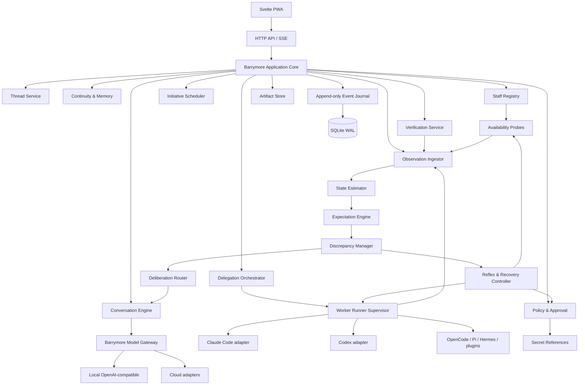

# Системная архитектура

## 1. Архитектурный стиль

Предпочтительный первый вариант — **Go modular monolith** с отдельными контролируемыми subprocess runners и Svelte web UI.

Причины: единая транзакционная граница для событий, памяти, ожиданий и поручений; простая локальная установка; один основной бинарник; лёгкая эксплуатация через user systemd; возможность позднее отделить тяжёлые runners без преждевременной микросервисности.

Frontend собирается и встраивается в Go binary либо поставляется как отдельные статические assets.

## 2. Архитектурная метафора и реальная граница системы

Бэрримор проектируется не как «LLM с множеством tools», а как постоянная распределённая управляющая система.

Условное соответствие:

| Метафора | Компоненты Бэрримора |
|---|---|
| Механика тела | транзакции, типы, filesystem boundaries, Git worktrees, идемпотентность |
| Рецепторы | adapters, watchers, probes, process events, checks |
| Локальные рефлексы | deterministic guards, retry, pause, reconnect, checkpoint, denial |
| Оценка состояния | projections, snapshots, freshness, confidence |
| Предсказание | Expectations и operational contracts |
| Осмысленное рассуждение | conversational/deliberative model |
| Действие в мире | tools, runners, workers и разрешённые side effects |
| Долгая непрерывность | Threads, memory, shared history, commitments и lessons |

Это только инженерная метафора. Она не предполагает наличия сознания, ощущений или человеческой субъектности.

Когнитивная граница проходит вокруг **runtime + данных + подключённых инструментов + workers + разрешённой рабочей среды**. LLM является сменяемым deliberative layer: она помогает понять неоднозначное, построить новый план, сформулировать позицию и вести разговор, но не обслуживает каждый низкоуровневый цикл.

## 3. Иерархия управления

### Уровень 0. Конструктивная безопасность

Ошибочные состояния предотвращаются устройством системы: транзакциями, foreign keys, atomic writes, path policies, worktree isolation, checksums, schema validation и idempotency keys.

### Уровень 1. Наблюдение и локальные реакции

Runtime принимает события, обновляет snapshots, проверяет Expectations и выполняет заранее ограниченные ReflexPolicy. Этот путь не требует LLM.

Примеры: восстановить SSE attachment, проверить PID, повторить безопасный probe, поставить run на паузу при запрещённой записи, пометить quota snapshot stale, сохранить checkpoint.

### Уровень 2. Процедуры

State machines и оркестраторы выполняют известные сценарии: подготовка WorkOrder, запуск worker, проверка результата, recovery после restart, memory candidate workflow.

### Уровень 3. Deliberation

Модель вызывается, когда требуется смысловая интерпретация, новая гипотеза, выбор между несколькими допустимыми стратегиями, переработка плана или объяснение пользователю.

### Уровень 4. Решение пользователя

Пользователь разрешает необратимые, платные, приватные и целевые конфликты, которые нельзя корректно разрешить действующими policies.

Нижний уровень не может расширять свои полномочия ради устранения расхождения. При нехватке разрешения он останавливается и эскалирует.

## 4. Основной предиктивный цикл

```text
Event / timer / explicit request
        ↓
Observation ingestion
        ↓
State estimation + freshness update
        ↓
Expectation evaluation
        ↓
No discrepancy ───────────────→ projection update
        ↓ discrepancy
Probe needed? ── yes ─────────→ bounded probe → new observation
        ↓ no / still unresolved
Known safe reflex? ─ yes ─────→ policy check → action → verify
        ↓ no / failed
Deliberative model needed? ───→ proposal / revised expectation
        ↓
User decision needed? ────────→ explicit Approval or question
        ↓
Journal outcome and update Thread/WorkOrder
```

Расхождение — не автоматически ошибка. Сначала runtime оценивает свежесть и достаточность наблюдений. Например, отсутствие heartbeat может означать потерю attachment, ожидание интерактивного ввода, зависание worker или завершившийся процесс.

Любая локальная реакция ограничена количеством попыток, cooldown, scope, текущим Approval и обязательной последующей проверкой результата.

## 5. Общая схема



## 6. Модули

### Event Journal

Append-only запись доменных событий, idempotency key, optimistic concurrency, транзакционное обновление проекций, replay, export и schema versioning. Значимое состояние нельзя хранить только в логах или chat history.

### Observation Ingestor

Нормализует сообщения, process events, file changes, timers, checks, probe results, external callbacks и пользовательские действия в типизированные Observation. Дедуплицирует события, сохраняет source metadata и не превращает недоверенный текст в command.

### State Estimator

Строит SystemStateSnapshot и предметные projections. Учитывает confidence, observed_at, valid_until, source quality и противоречия. Неизвестное состояние остаётся `unknown`, а не заменяется оптимистичным default.

### Expectation Engine

Создаёт и проверяет Expectations из WorkOrder operational contract, Commitments, waiting Threads, policies, timers и системных инвариантов. Поддерживает удовлетворение, expiry, supersession и восстановление после restart.

### Discrepancy Manager

Сопоставляет expected/observed, объединяет повторные сигналы, определяет severity, выбирает необходимость probe, reflex, deliberation или user escalation и не создаёт лавину одинаковых уведомлений.

### Reflex & Recovery Controller

Выполняет только зарегистрированные типизированные реакции. Каждая реакция имеет guards, policy scope, attempt limit, cooldown, expected result и verification. Свободный shell из текста модели здесь запрещён.

### Thread Service

Управляет жизненным циклом нитей, позициями, связями, решениями, вопросами, обязательствами и каноническими сводками.

### Conversation Engine

Поток:

1. определяет затронутые нити;
2. извлекает релевантный подтверждённый контекст и текущие discrepancies;
3. добавляет identity profile и policy constraints;
4. вызывает выбранную модель только при наличии разговорной или deliberative задачи;
5. валидирует структурированный результат;
6. записывает сообщение;
7. создаёт только candidates, proposals и новые Expectations;
8. не исполняет побочные эффекты напрямую из свободного текста модели.

Внутренний результат модели:

```json
{
  "reply": "Текст ответа",
  "thread_updates": [],
  "memory_candidates": [],
  "work_order_proposals": [],
  "commitment_candidates": [],
  "expectation_proposals": [],
  "probe_proposals": [],
  "initiative_candidates": []
}
```

Невалидный ответ не должен частично менять состояние.

### Deliberation Router

Решает, требуется ли LLM, deterministic procedure или пользователь. Учитывает severity, ambiguity, novelty, policy, стоимость, приватность, context budget и возможность сначала получить недорогой Probe.

Router не выбирает «думать моделью» только потому, что событие новое; он должен предпочитать наблюдение и типизированную процедуру, когда они достаточны.

### Barrymore Model Gateway

Поддерживает один выбранный conversational provider, local OpenAI-compatible endpoint, generic OpenAI-compatible cloud adapter, Anthropic adapter, streaming, cancellation, structured output validation, model revision metadata и explicit escalation policy.

Личность не хранится в весах. Смена модели не меняет память и доменную модель.

### Continuity & Memory

Memory candidate workflow, provenance, FTS5, optional embeddings, scope filters, redaction, supersession, retrieval trace и пользовательское редактирование. Embeddings являются индексом, а не источником истины.

Operational snapshots, transient discrepancies и heartbeat history не становятся долговременной памятью автоматически.

### Staff Registry

Registry workers, capabilities, trust, adapters, performance and availability snapshots. Объединяет конфигурацию, обнаружение executable, probe results, ручные поправки и историю выполнений.

### Delegation Orchestrator

Формирует WorkOrder и operational contract, выбирает worker, объясняет выбор, запрашивает Approval, готовит ContextPack, создаёт workspace, запускает worker, создаёт Expectations, собирает события, поддерживает pause/cancel, восстанавливается после рестарта, инициирует Verification и связывает результат с Thread.

### Worker Runner Supervisor

Отдельная граница побочных эффектов: PTY/non-interactive режимы, process groups, таймауты, resource limits, stdout/stderr capture, structured event parser, heartbeat, graceful cancel/hard kill, restart reconciliation, sandbox profile и scoped secret access.

Runner различает отсутствие вывода, потерю attachment, ожидание stdin, живой процесс без progress и завершённый процесс без собранного результата. Runner может быть отдельным helper binary.

### Policy & Approval

Проверяет workspace scope, filesystem scope, network scope, write level, cost, secrets, destructive side effects, publication, probes, reflex actions and worker trust. LLM, probe и reflex не могут отменить policy.

### Verification Service

Проверки build/test/lint, `git diff --check`, чистоты workspace, schema, обязательных артефактов, ожидаемого результата ReflexPolicy, ручное подтверждение и optional second-worker review.

### Initiative Scheduler

Инициатива строится на событиях и правилах: наступил срок обязательства, изменилось внешнее условие, нить ждёт решения, появился результат поручения, discrepancy требует внимания, истёк mute или сформирован полезный candidate. Каждая инициатива имеет причину и может быть отключена.

## 7. Активное получение информации

Tools используются не только для исполнения решения, но и для уменьшения неопределённости.

Примеры:

- `git status` проверяет предположение о чистоте worktree;
- process probe отличает зависание от ожидания stdin;
- повторный availability probe обновляет stale quota snapshot;
- test command проверяет утверждение worker;
- чтение фактической конфигурации уточняет, какой endpoint используется.

Probe должен быть минимальным, объяснимым, типизированным и не иметь более широкого side effect, чем требуется для ответа на вопрос.

## 8. Операционная «интероцепция»

Runtime наблюдает собственное рабочее состояние:

- доступность и latency model providers;
- context/token budget текущего вызова;
- workers, процессы, очереди и pending approvals;
- место на диске и целостность БД;
- freshness availability snapshots;
- количество повторов и циклов;
- активные network/secret scopes;
- degraded modules и незавершённые migrations;
- способность восстановить незавершённые runs.

Термин используется как инженерная метафора. В UI это отображается как состояние системы, а не как «самочувствие» программы.

## 9. Хранение

SQLite WAL хранит события, проекции, сообщения, metadata артефактов, Expectations, Discrepancies, SystemStateSnapshots, reflex attempts, FTS index, adapter registry, performance metrics, policies и approvals.

Высокочастотные наблюдения могут агрегироваться или иметь retention policy, но события решений, нарушений, реакций и эскалаций сохраняются для аудита.

Крупные артефакты находятся в файловом data root с checksum и metadata в БД.

```text
~/.local/share/barrymore/
  barrymore.db
  artifacts/
  runs/
  context-packs/
  exports/
  backups/

~/.config/barrymore/
  config.toml
  workers.d/
  policies.d/
  reflexes.d/

~/.cache/barrymore/
  indexes/
  temporary-workspaces/
  probe-results/
```

Secrets не находятся в обычной БД. Используются secret references на env, pass, system keyring или разрешённый local secret backend.

## 10. API и transport

Versioned JSON HTTP API, SSE для сообщений, observations, discrepancies и поручений, WebSocket только для interactive terminal attachment, CSRF/session protection, loopback bind по умолчанию и WireGuard-first remote access.

## 11. Deployment

Linux-first: основной binary, user systemd service, optional runner helper, локальный web UI, CLI для диагностики/backup/recovery. Контейнер не является обязательным способом установки.

## 12. Recovery

После старта система:

1. проверяет миграции и целостность event journal;
2. восстанавливает projections, активные Expectations и timers;
3. сверяет незавершённые WorkerRun с процессами;
4. помечает потерянные процессы и stale snapshots;
5. сохраняет последние логи и checkpoints;
6. выполняет разрешённые reconciliation probes;
7. предлагает retry/resume/reconcile либо эскалирует;
8. не объявляет поручение успешным без Verification.

Recovery является обычным продолжением предиктивного контура, а не отдельным аварийным режимом.

## 13. Наблюдаемость

Пользователь видит использованный контекст, модель, причину вызова модели, причину выбора worker, свежесть данных о лимите, активные ожидания, возникшие расхождения, probes, локальные реакции, выданные разрешения, реальные действия runner, проверки и изменения памяти.

Скрытые chain-of-thought не требуются. Нужны структурированные решения, основания, наблюдаемые события и граница между фактом, ожиданием и выводом.
